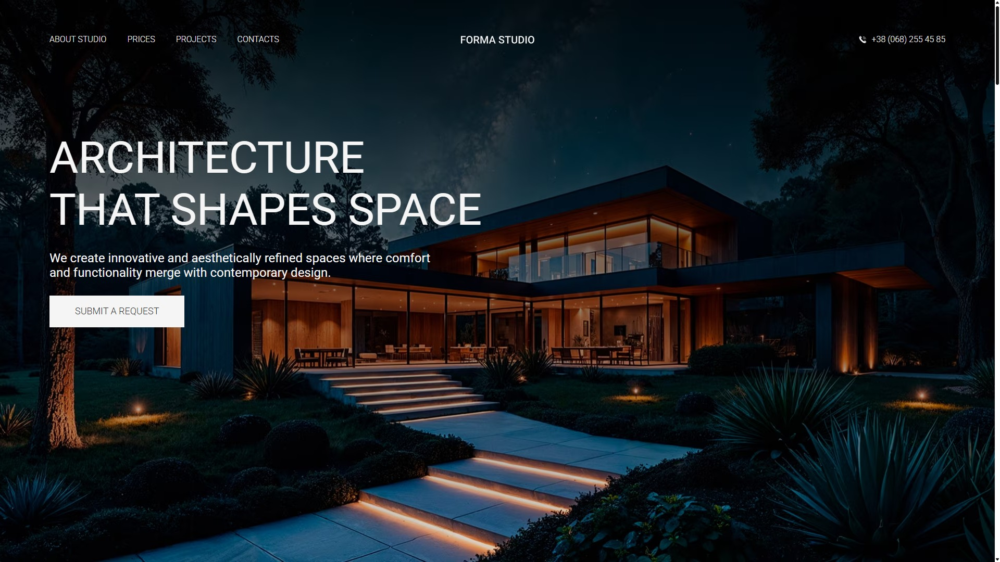
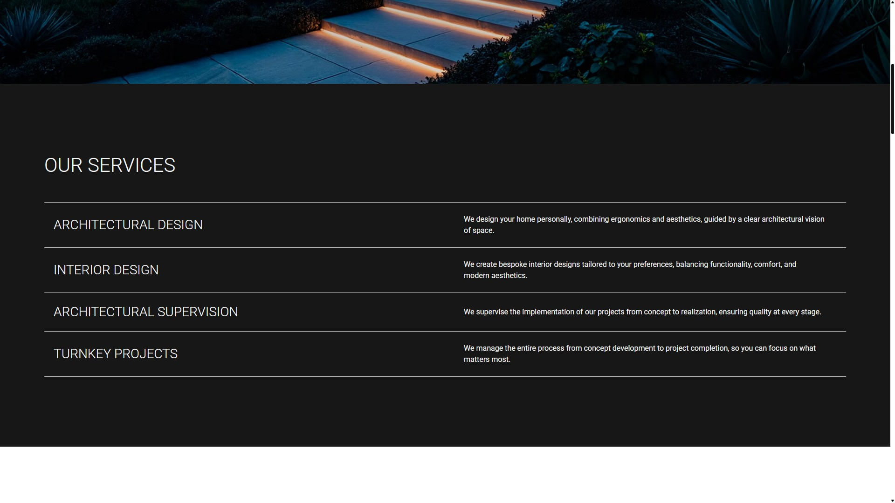
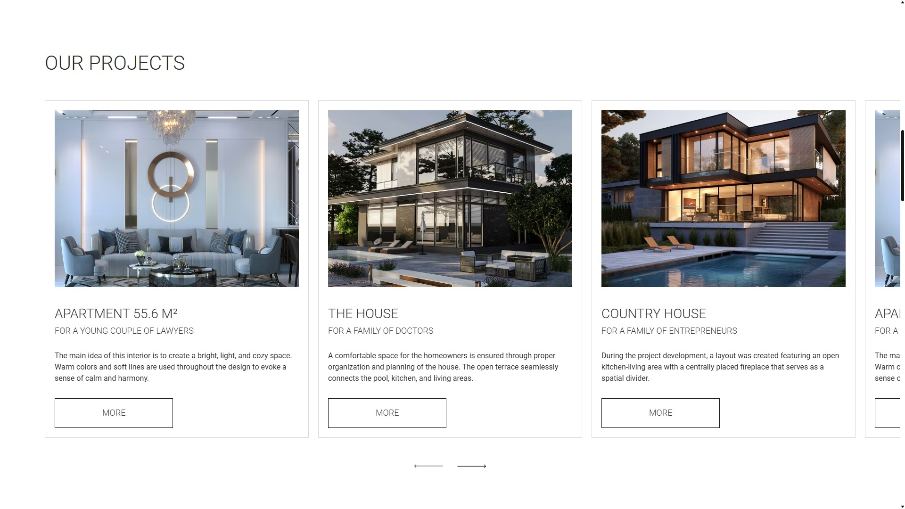
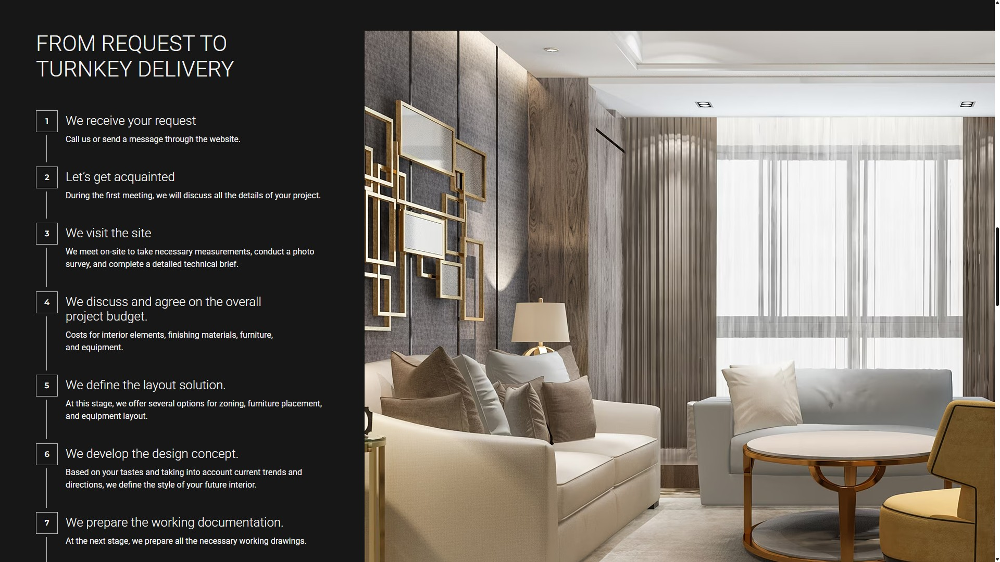
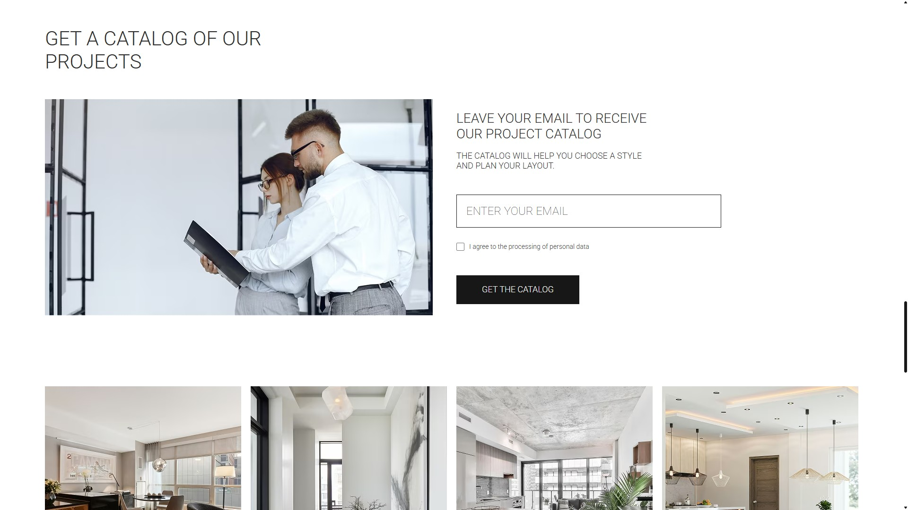
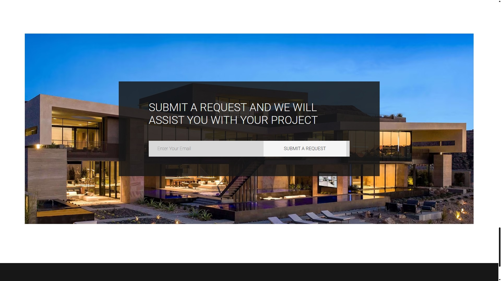
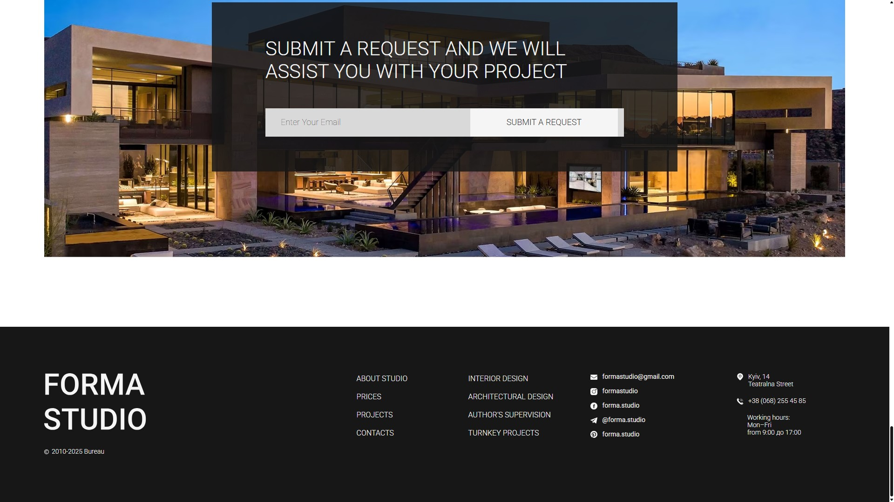

# Forma Studio

Landing page for the **Forma Studio** architecture and interior design bureau.

> A modern luxury-themed landing page built with **HTML**, **CSS**, and **JavaScript**.

---

## 🌐 Try it live

> Click the button above to open the live demo of the Forma Studio landing page.

---

## 🧰 Tech Stack

> Overview of the main tools and libraries used in this project.

**Core:**

- **HTML** — semantic markup with accessibility features
- **CSS** — modular styling with custom properties
- **JavaScript** — interactive functionality
- **Swiper.js** — smooth carousel for project showcase

---

## 📸 Screenshots

This gallery showcases each section of the landing page.

#### Header

#### Our Services

#### Our Projects

#### From Request to Turnkey Delivery

#### Get a Catalog

#### Submit a Request

#### Footer

---

## ⚙️ Development

This project uses plain HTML, CSS, and JavaScript with no build tools required.

---

## 🚀 Deployment

The project is automatically deployed to **GitHub Pages**.

You can view the live site here:
👉 [https://alexey-alanreys.github.io/forma-studio/](https://alexey-alanreys.github.io/forma-studio/)

---

**License:** MIT
**Author:** [Alexey Alan-Reys](https://github.com/alexey-alanreys)
